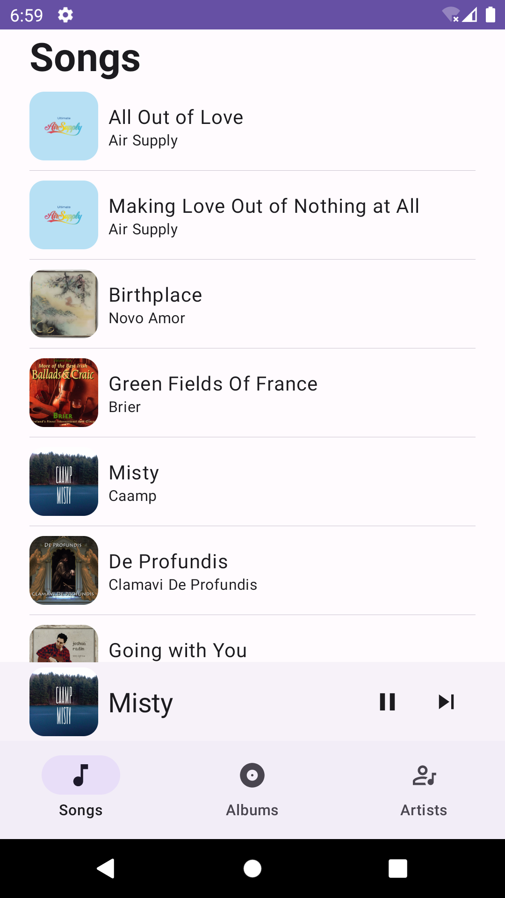
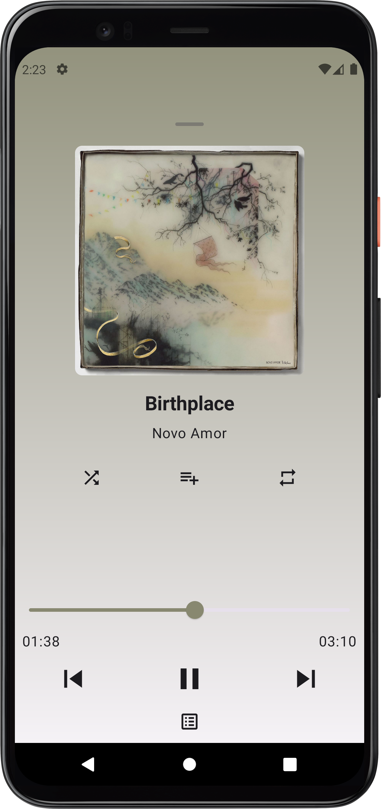

# Music
This is a music player that allows users to browse and play music present in their device storage.

**Music** app is entirely built with Kotlin and Jetpack Compose and it uses the Gradle build system.

## Screenshots
 &nbsp; 