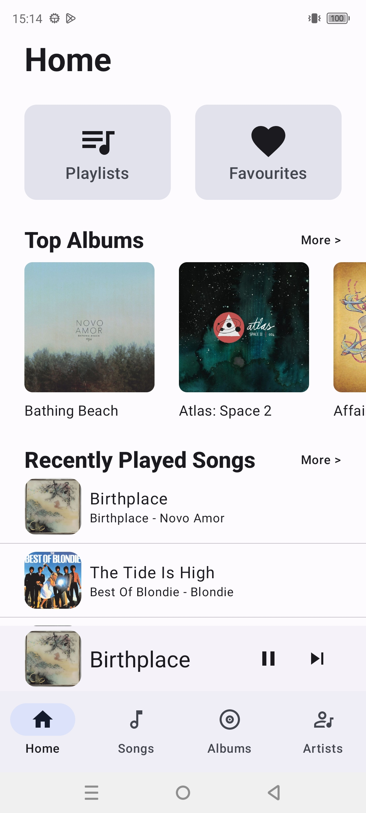

# Music
This is a music player that allows users to browse and play music present in their device storage.

**Music** app is entirely built with Kotlin, Jetpack Compose and uses media3 for media playback.

## Screenshots

### Light
 &nbsp;  &nbsp;  &nbsp;  &nbsp;  &nbsp; 

### Dark
 &nbsp;  &nbsp; 